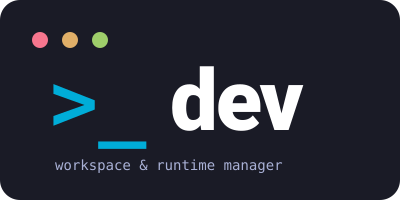

  

# dev

`dev` is a small, fast Development Environment Manager: a single Go binary
that installs and switches language/runtime versions and organizes a
developer workspace.

This build covers the CLI foundation, language/runtime version management
(`dev lang`), PATH management (`dev env`, `dev setup`), and workspace
management (`dev workspace`).

## Install from a release

Download the archive for your platform from
[Releases](https://github.com/jpsdm/dev/releases) and extract it — it
contains just the `dev`/`dev.exe` binary plus `README.md` and `LICENSE`,
flat, no subfolder.

**Extract it anywhere temporary** (a downloads folder is fine) and run
`dev setup` from inside that folder — `./dev setup` on Linux/macOS,
`.\dev.exe setup` on Windows. That one command does the whole install:

1. creates `$DEV_HOME` (`~/.dev` unless you set `DEV_HOME` yourself);
2. offers to move `dev`, `README.md`, and `LICENSE` into `$DEV_HOME`
   itself — **answer yes**, this is what actually installs `dev`;
3. detects every shell you have installed and, with your confirmation,
   installs a small `dev` shell function (not a separate binary) into
   each one's rc file/profile — not just whichever shell happens to be
   running `dev setup`. On Windows, for instance, having both
   PowerShell and Git Bash installed gets both configured in one run.
   The function runs the real `dev` command, then — only after `dev
   lang`/`dev l` — refreshes `PATH` in your current shell so a
   newly-activated version takes effect immediately, no restart
   needed. The function puts `$DEV_HOME` on your `PATH`, where `dev`
   itself lives, and adds each language's currently-active version's
   own `bin` directory directly — no copies, no symlinks. Re-running
   `dev setup` later (after installing a shell that wasn't present
   before) only offers what's new — an already-configured shell is
   left untouched. A shell dev can't safely auto-edit (or can't detect
   at all) gets the function printed to add by hand instead; on
   Windows, `dev setup` also offers to write your user environment
   variables directly.

Each of those steps asks for confirmation first; declining the very
first question exits without touching your machine at all.

Once you've confirmed the move, the folder you extracted into is empty
and can be deleted. Restart your shell (or source the rc file `setup`
names) and plain `dev` works from any terminal.

Don't install `dev` by hand into a directory that's already on `PATH`
instead: `dev` refuses to run every command except `setup`, `version`,
and `help` unless it's running from `$DEV_HOME`, so a copy left
somewhere else will just tell you to run `dev setup`. Running `setup`
and confirming the move is the supported install.

## Requirements

- Go 1.25 or later to build from source (the floor tracks
  `github.com/go-git/go-git/v5`'s own module requirement, not a feature
  this project itself needs — CI's `go-version: 'stable'` means nothing
  breaks there)
- No runtime dependency (Node.js, Python, etc.) is required to run `dev`
  itself — it ships as a single static binary

## Building from source

    make build   # CGO_ENABLED=0, version injected via git describe
    make test    # go test ./...
    make lint    # golangci-lint
    make check   # fmt + vet + lint + test + build — the same gate CI runs

See [CONTRIBUTING.md](CONTRIBUTING.md) for the full development setup,
project layout, and code conventions if you're planning to make a change.

## Releases

Pushing a tag matching `vX.Y.Z` triggers `.github/workflows/release.yml`,
which cross-compiles `dev` for Linux, macOS, and Windows (amd64 and
arm64), packages each build into an archive with a `checksums.txt`
covering all of them, and creates a **draft** GitHub Release with
everything attached — reviewed and published manually, not automatic.

`make build` (used for local development) derives its version from
`git describe --tags --always --dirty` rather than a real release tag,
so it prints something like `0.1.0-3-gabc1234-dirty` rather than a
clean release version — this is expected and only matters for actual
tagged releases.

See [RELEASING.md](RELEASING.md) for the full step-by-step (first push,
cutting a release, and why an ordinary commit — including a
documentation-only one — never triggers one).

## Staying up to date

    dev update    # check GitHub for a newer release and install it (asks for confirmation)

`dev version` and every other command also print a one-line notice when a newer release
is available — at most once every 24 hours (cached in `config.json`), never on a network
failure, and never for a locally-built `dev` (one whose version isn't a plain `vX.Y.Z`
release tag). Set `DEV_NO_UPDATE_CHECK=1` to disable this entirely.

## Usage

    dev --version
    dev version
    dev --help

Only `dev version` shows the update-available notice (see "Staying up to date" above) —
`dev --version` bypasses it because Cobra's built-in `--version` flag handling returns
before that check ever runs.

## Language management

    dev lang list                  # newest version of every supported language
    dev lang list node             # all available Node.js major versions
    dev lang install node 22
    dev lang use node 22
    dev lang install java 21
    dev lang use java 21
    dev lang install go 1.24
    dev lang use go 1.24
    dev lang install python 3.12
    dev lang use python 3.12
    dev lang current               # active version of every language
    dev lang installed
    dev lang uninstall node 22

Aliases: `l` for `lang`, `ls` for `list`, `c` for `current`, `i` for
`install`, `u` for `use`.

Currently supported languages: Node.js, Java (Eclipse Temurin), Go, Python
(via python-build-standalone).

The Java majors listed by `dev lang list java` are all majors Temurin
tracks upstream — not every major has a Temurin build for every OS/arch
(e.g. Adoptium currently ships no macOS/aarch64 build for Java 8 or 16),
so `dev lang install java <version>` may fail on some platforms for a
version that otherwise exists.

Similarly, `python-build-standalone`'s Windows/arm64 builds only exist for
Python 3.11 and newer — `dev lang list python` on that platform won't offer
earlier minors. Its Windows builds also ship no `pip`/`pip3` executable at
all (only the `pip` module, no prebuilt console-script entry point), so
there is nothing for `dev` to put on `PATH` under those names — `pip`
resolves to whatever `pip` the rest of your `PATH` already provides, or
reports "command not found" if there isn't one. Use `python3 -m pip`
instead.

## PATH management

    dev env      # print the current PATH export lines for your shell
    dev setup    # detect your shell, confirm, and install the dev function

`dev setup` installs a `dev` shell function (not a separate binary) into
your shell's rc file. The function always runs the real `dev` command
first; afterward, only for `dev lang`/`dev l` invocations, it re-evaluates
a fresh `dev env` in your **current shell**, so `dev lang use`/`dev lang
uninstall` take effect immediately — no restart, no sourcing anything by
hand.

`dev env` computes `PATH` fresh every time it runs: it starts from your
shell's current `PATH`, strips any entry under `$DEV_HOME/versions/...`
(so a previous run's own entries never accumulate), then prepends
`$DEV_HOME` and each registered language's currently-active version's real
`bin` directory. There are no copied binaries, symlinks, or junctions
anywhere in this — `node`, `java`, `python`, etc. resolve on `PATH`
straight to the real binary inside `versions/<lang>/<version>/...`. A
tool installed later by a language's own package manager (`npm install -g
pnpm`, a `pip`-installed console script) is reachable the moment it's
installed, since it lands inside that same active version's `bin`
directory.

Running a command for a language with no active version is ordinary shell
"command not found" — there's no `dev`-provided binary standing in to
print a friendlier message, the same as `nvm`/`mise` without shims.

**Upgrading from a `v0.7.0` or earlier install:** run `dev setup` once to
replace your rc file's old static `PATH` lines with the new function.
Until you do, `dev` keeps working exactly as it did before (the old
shim/symlink mechanism stays in place, untouched) — nothing here breaks
an un-migrated shell. The old `$DEV_HOME/bin`, `$DEV_HOME/active/*`, and
`$DEV_HOME/no-active/*` directories become unused once you do migrate;
they aren't deleted automatically and are safe to remove by hand.

On a machine with a system-installed JDK, activating a Java version with
`dev lang use java <version>` adds that version's `bin` directory ahead of
the rest of `PATH`, so `java`/`javac` resolve to the activated version
instead of the system JDK. Before any version is activated, there's no
`dev`-provided entry for Java at all, so `java`/`javac` just resolve to
the system JDK as normal — the same behavior every other language has.

On Windows there's a caveat to that precedence: `dev setup` only writes
the **current user's** environment (`HKCU`), never the machine-wide one
(`HKLM`). Windows builds the final `PATH` with the system entries ahead
of the user's, so a JDK installed system-wide can still win over
`$DEV_HOME`'s entries. Fixing it would mean writing to `HKLM`, which needs
administrator rights and would change the environment for every account
on the machine — `dev` deliberately never does that. If you hit it, move
the `dev` entries ahead of the JDK in the system `PATH` by hand, or
uninstall the system-wide JDK and manage Java through `dev lang`.

## Workspace

    dev workspace                  # ensure the workspace is initialized (asks for a folder name and location on first use)
    dev workspace new api          # create src/api from the base/ template
    dev workspace scratch spike    # create scratch/spike from the base/ template
    dev workspace clean api        # remove src/api's gitignored files
    dev workspace clean api --dry-run
    dev workspace clean --all      # clean every project in src/ (asks for confirmation)
    dev workspace archive api      # clean src/api, then move it to archive/api
    dev workspace archive api --dry-run
    dev workspace metrics          # show project counts and sizes

Aliases: `ws` for `workspace`, `c` for `clean`, `a` for `archive`, `m` for
`metrics`, and `s` for `scratch` — each works both under `workspace` and
under its `ws` alias (e.g. `dev workspace s <name>` and `dev ws s <name>`
are equivalent).

The workspace root holds `src/` (active projects), `scratch/`
(experiments), `archive/` (archived projects), and `base/` (files copied
into every new project or scratch — e.g. `.editorconfig`, `.gitignore`,
`README.md`).
`clean` uses each project's real `.gitignore` (including nested files) to
decide what gets removed — the same set `git clean -Xdf` would remove from
the project's own `.gitignore` files (a global excludes file or
`.git/info/exclude` is not consulted) — and never requires the project to
be a git repository.

## Contributing

Bug reports, feature requests, and pull requests are welcome — see
[CONTRIBUTING.md](CONTRIBUTING.md) for the development setup, project
conventions, and how to propose a new language provider. This project
follows the [Contributor Covenant](CODE_OF_CONDUCT.md). Found a security
issue? Please read [SECURITY.md](SECURITY.md) instead of opening a public
issue.
